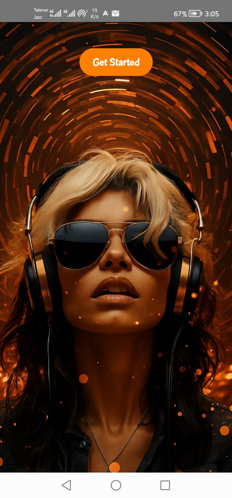
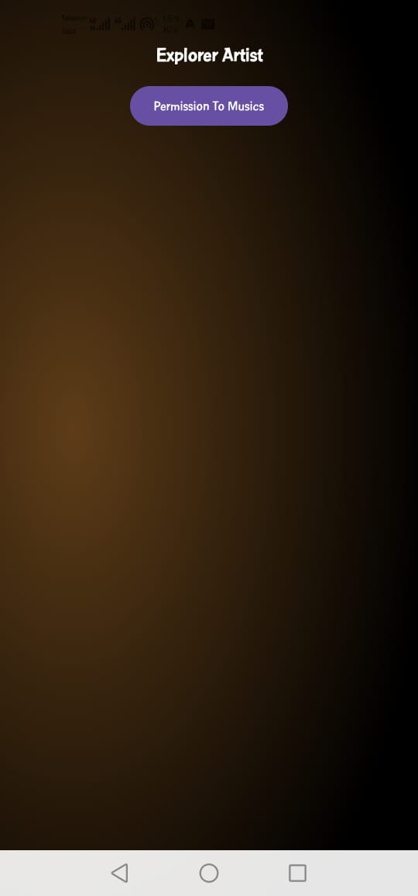
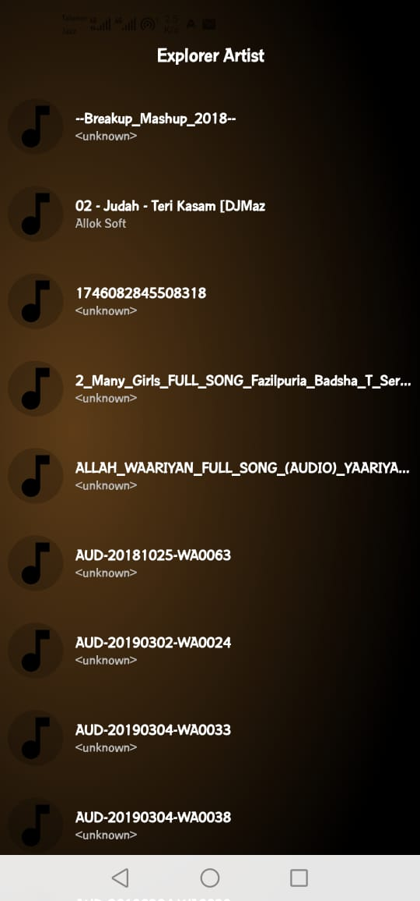

# 🎵 AuraBeats – Music Player App

AuraBeats is a modern **Android Music Player application** developed using **Kotlin**.  
The app allows users to browse, play, and manage audio files stored on their device with a clean and user-friendly interface.

This project is developed as part of an **academic / FYP project** to understand Android development, media handling, and UI design using Kotlin.

---

## 🚀 Features

- ▶️ Play, pause, next, and previous song controls  
- 📂 Fetches music directly from device storage  
- 🎧 Displays song title, artist, and album information  
- 🖼️ Album artwork support  
- 🔁 Repeat and shuffle functionality  
- 📱 Simple and clean UI design  
- ⚡ Smooth performance with Kotlin

---

## 🛠️ Technologies Used

- **Language:** Kotlin  
- **IDE:** Android Studio  
- **UI:** XML / Jetpack Compose (if applicable)  
- **Media API:** Android MediaStore & MediaPlayer  
- **Architecture:** MVVM (if used)  

---

## 📱 App Screenshots

### 🏠 Home Screen

*Welcome screen with Get Started button*

---

### 🎧 Music Permission

*Permission request to access music files*

---

### 📂 Storage Access

*Request for local storage access*

---

### 🎶 Music Playlist

*Displays all available music tracks*

---

### ▶️ Now Playing Screen

*Music player with play, pause, next, and previous controls*

